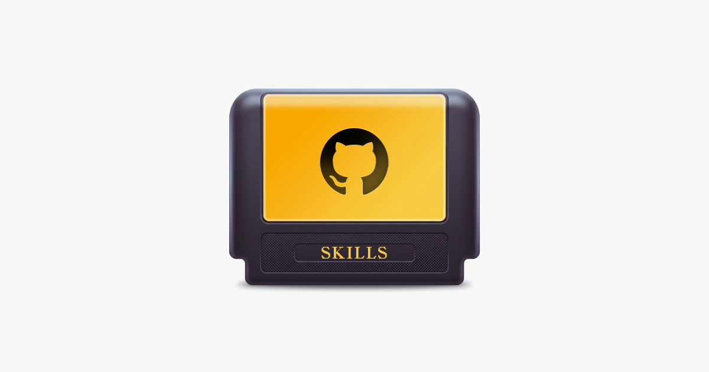

<a href="https://nicktarasov.com">
  
</a>

# Skills for design engineers

Agent skills I use with Claude Code to design and ship faster. They cover building UI components from Figma, design tokens, Storybook, and Linear issue + PR workflows.

## Install

```bash
npx skills@latest add nickdraft/skills
```

## Skills

- **[design-component](skills/design-component/SKILL.md)** — Design-system workflow for building UI components: Figma → build (CVA, Radix, `cn()`, tokens) → Storybook (CSF3 + autodocs) → QA.
- **[linear-pr-merge-sync](skills/linear-pr-merge-sync/SKILL.md)** — Reconciles Linear issues, sub-issues, and project status against a PR (open or merged): comments what shipped, flags what's missing, and files follow-up issues, all gated on your approval.
- **[linear-prioritise-issues](skills/linear-prioritise-issues/SKILL.md)** — Wires an explicit execution order across a set of Linear issues using blocking relations + priority bumps, so the sequence reads at a glance in list views.

## Requirements

- **design-component** targets a **React + Tailwind** project — including [Next.js](https://nextjs.org/) (add `"use client"` to interactive components in the App Router) — using [class-variance-authority](https://cva.style/), [Radix UI](https://www.radix-ui.com/), [framer-motion](https://motion.dev/), and [Storybook](https://storybook.js.org/) (latest, 10.x), plus a Figma MCP server for extracting specs. It's React-specific by design; Vue/Svelte/Solid aren't supported as-is.
- **linear-pr-merge-sync** and **linear-prioritise-issues** require a [Linear MCP server](https://linear.app/docs/mcp) (`mcp__linear-server__*` tools).
